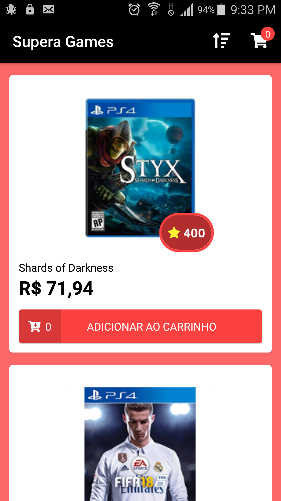

# Supera Games

_A games e-commerce app prototype made with React Native_



## Features

-   User can see a list of games for sale
-   User can sort that list by price, name or popularity
-   User can add games to shopping cart (and remove them)
-   User can choose how many units of each game to keep in the cart
-   User can clear shopping cart clicking on 'Comprar Tudo' button
-   Total price and shipping costs are dynamically calculated

## How to run

To clone and run this application, you'll need Git, Node.js and NPM installed on your computer. From your command line:

```bash
# Clone this repository
$ git clone https://github.com/westgoten/SuperaGames.git

# Go into the repository
$ cd SuperaGames

# Install dependencies
$ npm install

# Start Metro bundler
$ npx react-native start

# Run the app (iOS)
$ npx react-native run-ios

# Run the app (Android)
$ npx react-native run-android
```


## Libs & Frameworks

-   [React Native](https://reactnative.dev/)
-   [React Navigation](https://reactnavigation.org/)
-   [Redux](https://redux.js.org/)
-   [React Redux](https://react-redux.js.org/)
-   [Styled Components](https://styled-components.com/)
-   [react-native-fontawesome](https://github.com/FortAwesome/react-native-fontawesome)

## License

Read about license rights and limitations [here](LICENSE).
